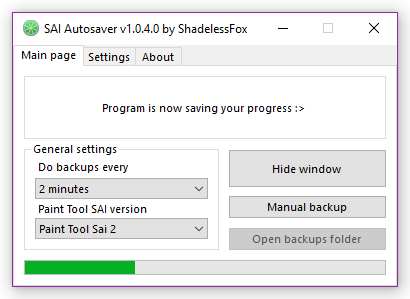

# PaintToolSaver
Small saving util for PaintTool SAI 1 & 2. _Enjoy and create art without pain._

## Features
* Support for SAI 1 _(legacy)_ & SAI 2
* Backup system that copies project file to selected directory every time project saved
* Notification when project was created, but never saved locally
* Flexible saving delay periods _(from 30 seconds up to 2 hours)_
* Display current save progress on SAI's icon in taskbar _(experimental)_
* Show only in tray until double-click on its icon
* Launch with Windows in tray at startup

